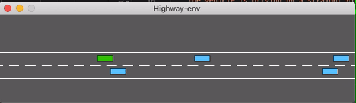
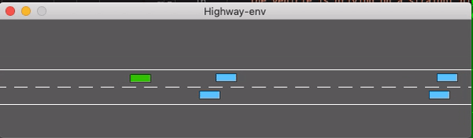
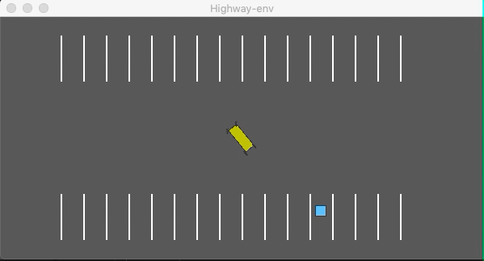
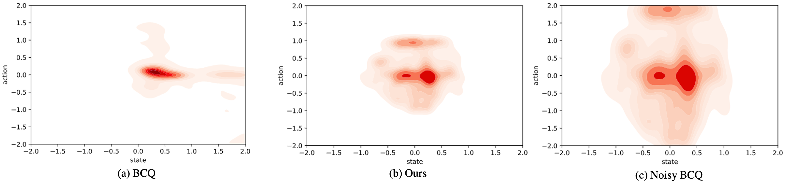

# Final project

# Assignment-2

# Safe and Efficient offline reinforcement learning 

### Abstract
Many practical online reinforcement learning applications, such as autonomous driving, will involve interactions with environment, which will have high deployment cost. In this work, we propose an offline reinforcement learning approach to learn from the collected dataset. Due to the conservativeness of most off-line reinforcement learning method, we introduce an exploration strategy to make the agent to explore efficiently in the environment. Meanwhile, we also introduce the Lyapunov functions to provide the safety guarantee during the policy learning process. An efficient and safe off-line reinforcement learning method is designed to allow the agent can not only efficiently explore the action space but also guarantee safety. Numerous experiments have been conducted in autonomous driving tasks to evaluate the learned policy. The experimental results indicate that the proposed model outperforms the baseline method.

### Environment

Method is tested on [highway](https://highway-env.readthedocs.io/)  continuous control tasks in [OpenAI gym](https://github.com/openai/gym). 
Networks are trained using [PyTorch 1.4](https://github.com/pytorch/pytorch) and Python 3.7. 


### Overview

Train the model:
```
python code/run.py --test False
```
Test model:
```
python code/run.py --test True
```
You could define model type and which character to draw:
```
python code/run.py --test True --model_type HER --character Z
```
Settings can be adjusted with different arguments to run.py.

### Results

The left one is using our method , the right one is using Noisy BCQ.

1. Highway scenario
<p float="left">
  
   
</p>

2. Parking scenario
<p float="left">
  
   
</p>

3. Visulization of the state action visitation density
<p float="left">
  
</p>


### Report

[Here](https://github.com/McGill-COMP-766-ECSE-683-Assignments/assignment-2-SHITIANYU-hue/blob/main/ECSE683assignment2_TianyuShi.pdf)

### Contact

Tianyu Shi: tianyu.shi3@mail.mcgill.ca


